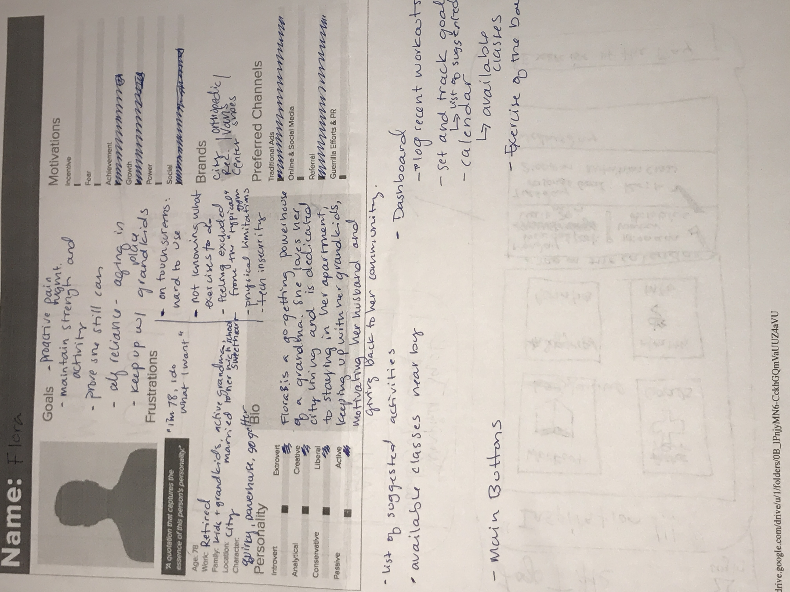
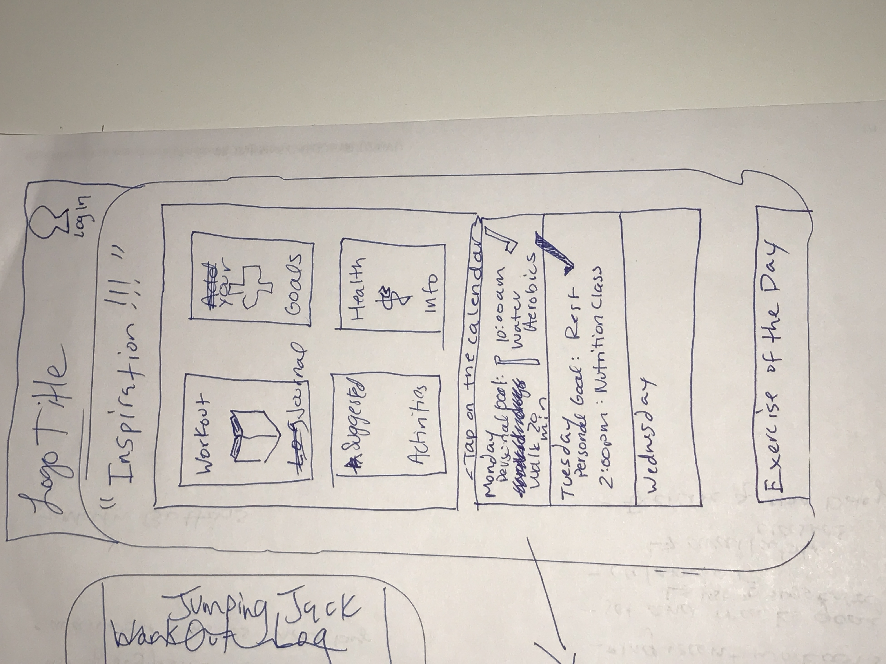
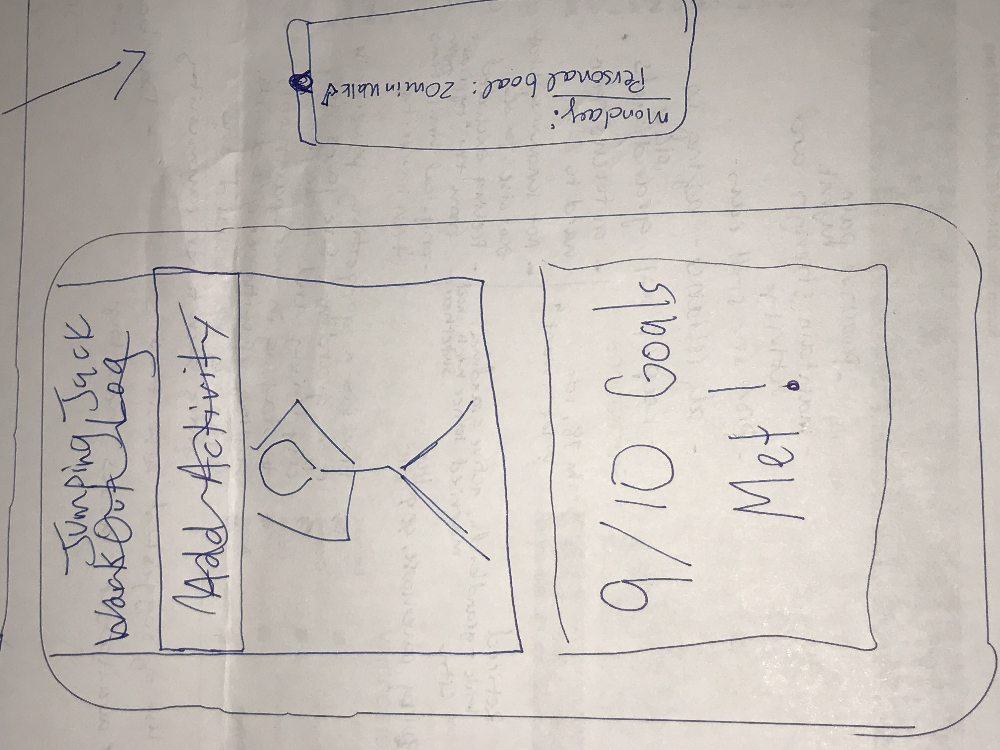
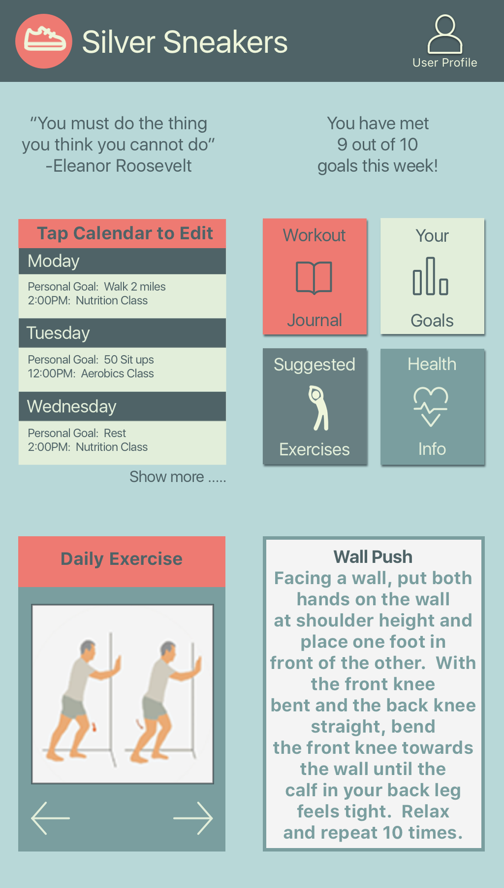
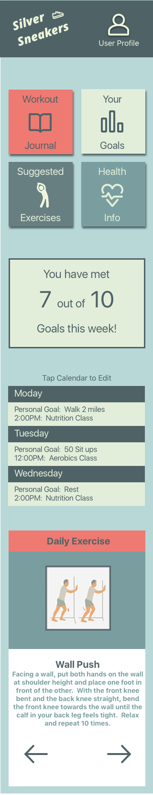

## UX/UI Challenge

#### Design Constraints: 
Design the dashboard of a workout tracker for a 78 year old.

#### Inspiration:
* [Fitness Tracker Dashboard inspiration - takeaway: too busy for someone tech insecure](https://www.behance.net/gallery/51587483/MAA-Fitness-App-Interaction-Design)
* [Senior specific fitness app - takeaway: good buttons and love the exercise display](https://play.google.com/store/apps/details?id=com.ebmacs.dailyseniorfitnessexcercise&hl=en)
* [Tactile clock with reminders - takeaway: include a schedule with reminders for goals as well as social activities](https://www.behance.net/gallery/52030451/ROVA-An-interactive-clock-for-the-elderly)

#### Persona and Wireframing:
* 
* 
* 

##### Bio: "I'm 78, I do what I want."
Flora B. is a go-getting powerhouse of a grandma. She loves city living and is dedicated to aging in place, keeping up with her grandchildren as much as her robust social and volunteer life, and motivating her husband and friends to rage with her against the dying of the light.

##### Goals:
* proactive pain management
* prove she still can
* self-reliance 
* aging in place
* keeping up with her grandkids

##### Frustrations
* Touchscreens are hard to use
* Not knowing what exercises to do/ are safe/ doctor recommended
* Feels excluded from the typical gym
* physical limitations
* tech insecurity

#### Comp:
* 
* 

